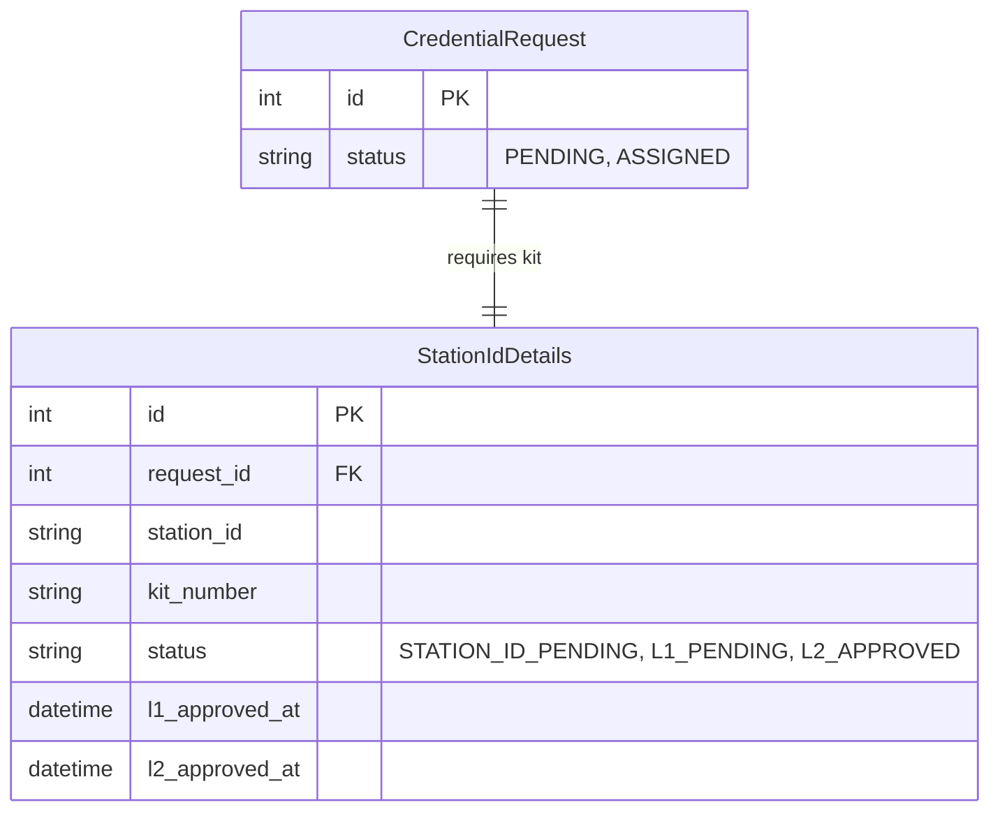
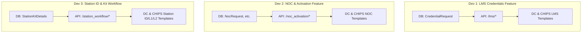

# CHiPS Aadhaar Portal: Developer Guide & Future Development Roadmap

This guide provides a comprehensive overview of the current project architecture, details the files created so far, and outlines a structured workflow for a 3-member development team to build out future modules (NOC, Activation, Reactivation, Station ID Kit Process, L1, L2) and merge them cleanly.

---

## 📖 Part 1: Current Architecture & File Explanation

The portal uses a **decoupled architecture** separating concerns between the user interface and the business logic/database operations.

### High-Level Design Flow
```mermaid
graph TD
    UI[Browser Client] <-->|HTML / HTMX AJAX| Flask[Flask Proxy Server (Port 5000)]
    Flask <-->|REST API + JWT Auth| FastAPI[FastAPI Core Server (Port 8000)]
    FastAPI <-->|SQLAlchemy ORM| DB[(PostgreSQL Database)]
```

*   **Flask Proxy Server** handles session management (cookie-based), template rendering, and proxying client form requests to the API. It uses **HTMX** to execute dynamic, partial-page swaps without full page refreshes.
*   **FastAPI Core Server** acts as the stateless API gateway. It handles request validation (Pydantic), user authentication (JWT tokens + Password hashing), and all database queries (SQLAlchemy).

### Detailed File Walkthrough

#### 1. Backend Gateway (`backend/`)
*   **[backend/database.py](file:///d:/project/Chips-portal/backend/database.py)**: Initializes the SQLAlchemy engine using the environment configuration `DATABASE_URL`. Provides `SessionLocal` for transactional database sessions and the `get_db` dependency for route handlers.
*   **[backend/models/](file:///d:/project/Chips-portal/backend/models/)**: Modular package directory defining database models mapped to PostgreSQL tables:
    *   `base.py`: Shared core entities (`User`, `District`, `UserRole` enum) and timezone helper `get_ist_time()` (represeting naive local Indian Standard Time, UTC+5:30).
    *   `lms.py`: LMS operator credential request model (`CredentialRequest`).
    *   `__init__.py`: Aggregates all model files and exports them under the `__all__` list so imports remain centralized.
*   **[backend/routers/auth.py](file:///d:/project/Chips-portal/backend/routers/auth.py)**: Handles authentication endpoints:
    *   `POST /auth/login`: Validates password hashes (Bcrypt) and returns JWT tokens.
    *   `GET /auth/me`: Authenticates JWT headers and returns user profile details (username, role, district).
*   **[backend/routers/lms.py](file:///d:/project/Chips-portal/backend/routers/lms.py)**: Contains operator request endpoints:
    *   `POST /lms/request`: DC operator submission. Verifies DC roles and district boundaries.
    *   `PUT /lms/assign/{request_id}`: CHIPS Admin credentials assignment.
    *   `GET /lms/requests`: Fetches operator request lists (DCs see their district's data; admins see all data).
*   **[backend/main.py](file:///d:/project/Chips-portal/backend/main.py)**: FastAPI entrypoint. Sets up CORS middleware and includes authentication and LMS routers.

#### 2. Frontend Proxy (`app/`)
*   **[app/__init__.py](file:///d:/project/Chips-portal/app/__init__.py)**: Flask application factory. Sets up views and proxy endpoints:
    *   `GET /`: Renders login page.
    *   `POST /auth/login`: Handles login form submissions, calls FastAPI `/auth/login`, saves tokens to Flask `session`, and redirects users based on roles.
    *   `GET /dc/dashboard`: Renders the DC overview landing dashboard (`dc_dash.html`) showing dynamic request stats.
    *   `GET /lms`: Renders the DC LMS Registration page (`lms.html`) with sidebar controls.
    *   `GET /chips/dashboard`: Renders the CHIPS Admin overview landing dashboard (`chips_dash.html`) with dynamic statistics.
    *   `GET /chips/lms`: Renders the CHIPS Admin LMS Review page (`chips_lms.html`).
    *   `POST /lms/request`: Proxies DC registration forms to FastAPI. On success (201/200), returns a `<tr>` HTML snippet prepended to the history list. On validation error (400), parses Pydantic error details and targets them to the `#dc-form-error` alert card using the `HX-Retarget` response header.
    *   `POST /chips/assign/<int:request_id>`: Proxies credentials assignment requests to FastAPI, returning `HX-Refresh` to reload the page on completion.
*   **[app/templates/](file:///d:/project/Chips-portal/app/templates/)**: 
    *   `base.html`: Common layout wrapper importing HTMX.
    *   `auth/login.html`: White-themed login layout.
    *   `dc/dc_dash.html`: DC overview landing page displaying dynamic counts and requests table (includes `partials/sidebar.html`).
    *   `dc/lms.html`: DC LMS registration form (with numerical phone filters, alphabetical name filters, locked district field) and request history table with date filters (includes `partials/sidebar.html`).
    *   `chips/chips_dash.html`: CHIPS Admin overview page showing dynamic stats cards and recent requests table (includes `partials/sidebar.html`).
    *   `chips/chips_lms.html`: CHIPS Admin LMS review console containing search bars, district/date dropdown filters, pending credentials queue, and approved log logs (includes `partials/sidebar.html`).
    *   `partials/sidebar.html`: Unified, reusable sidebar partial that dynamically handles active links based on route rules and is shared across all dashboards.
*   **[app/static/css/](file:///d:/project/Chips-portal/app/static/css/)**: 
    *   `common.css`: Baseline resets, headers, profiles, standard tables, generic HTML fallback styles, and badges.
    *   `layout.css`: Persistent sidebar layouts (fixed positioning, independent vertical scrolling on desktop, custom details/summary arrows), hamburger buttons, collapse states, grid cards, and mobile view breakpoints.
    *   `dc_dashboard.css`: Form row structures and validation styling for the DC panels.
    *   `chips_dashboard.css`: Mini-form layouts, table search inputs, and Issue button styles.

#### 3. Root Level
*   **[seed.py](file:///d:/project/Chips-portal/seed.py)**: Populates baseline database records (creates Raipur, Bilaspur, Durg districts, and default `dc_raipur` and `chips_admin` profiles).
*   **[.gitignore](file:///d:/project/Chips-portal/.gitignore)** & **[.env.example](file:///d:/project/Chips-portal/.env.example)**: Ensure credential settings are ignored by Git, leaving a clean variable configuration template for developers.

---

## 🗺️ Part 2: Future Development Scope (NOC, Activation, Reactivation, Kit Process)

Your next phase is expanding the portal to handle other operator workflows:
1.  **NOC Requests**: Operators requesting a No Objection Certificate.
2.  **Activation Requests**: Setting up a new operator.
3.  **Reactivation Requests**: Resuming operator status after suspension.
4.  **Kit Process & Station ID**: Assigning hardware kit details and allocating a Unique Station ID.
5.  **Multi-Level Approval Workflow**: Station ID assignment, Level 1 (L1) review, and Level 2 (L2) final sign-off.

### Database Schema Expansion Proposal
To support these features, you will need to add new models (or tables) in `backend/models.py`. 



---

## 👥 Part 3: Parallel Development Workflow (Full-Stack Feature Slices)

To give each team member complete ownership of their feature set, the work is split into **vertical slices by feature lifecycle**. Each developer is fully responsible for the Database Models, FastAPI backend endpoints, and Frontend views (both the DC form page and the CHIPS Admin action page) for their assigned feature.



### 👤 Developer 1: LMS Operator Credentials Lifecycle (Built-in Reference)
*   **Feature Scope**: The core portal to register operators and issue LMS credentials.
*   **DC Side Page**: The operator registration form, input validations (numerical phone, alphabetical names, locked district), and request history list.
*   **CHIPS Admin Side Page**: The pending queue, assign credentials forms, and the approved credentials log history.
*   **Backend & DB**: `CredentialRequest` models, Pydantic schemas, and API routers.

### 👤 Developer 2: NOC, Activation, and Reactivation Lifecycles
*   **Feature Scope**: The requests for No Objection Certificates (NOC), operator activations, and suspended operator reactivations.
*   **DC Side Page**: The submission forms for NOC, Activation, and Reactivation, including form state retention on error, custom input validation, and history lists.
*   **CHIPS Admin Side Page**: The review queues where admins can approve or reject NOC/activation requests, and the corresponding approved/rejected log history.
*   **Backend & DB**: Database tables (`NocRequest`, `ActivationRequest`, etc.), Pydantic schemas, and routers (e.g. `POST`, `GET`, and status update endpoints).

### 👤 Developer 3: Station ID, Kit Process, and L1/L2 Verification Workflows
*   **Feature Scope**: Hardware kit tracking, Station ID generation, and multi-level approval workflows (L1 review and L2 final sign-off).
*   **DC Side Page**: The dashboard displaying kit allocation statuses, station ID statuses, and status tracking (e.g. `L1 Verification Pending`).
*   **CHIPS Admin Side Page**:
    *   **L1 Queue**: Level 1 verification console where L1 officers review and check operator/district details.
    *   **L2 Queue**: Level 2 final sign-off console where L2 officers issue unique Station IDs and assign Kit Numbers.
*   **Backend & DB**: Tables for `StationKitDetails` and approval history logs, Pydantic schemas, and role-restricted API routers.

---

## ⚙️ Part 4: Git Branching & Merging Strategy (Conflict-Free Full-Stack Integration)

Since each developer is writing database code, backend endpoints, and frontend pages at the same time, you must follow strict **file isolation rules** to prevent git merge conflicts.

### Rule 1: Isolate Files by Feature (Zero Overlapping Files)

To avoid developers editing the same core code files simultaneously, separate your code using folders:

#### 1. Database (Models & Migrations)
Instead of all developers adding classes directly to a single `models.py` file, split them:
*   Use the `backend/models/` folder and place models in separate files:
    *   `backend/models/dc_requests.py` (Developer 1)
    *   `backend/models/station.py` (Developer 2)
    *   `backend/models/approvals.py` (Developer 3)
*   Expose them in a single `backend/models/__init__.py`.

#### 2. Backend Gateways (FastAPI Routers)
*   Each developer writes their endpoints in their own file under `backend/routers/` (e.g. `dc_requests.py`, `station.py`, `approvals.py`).
*   Only register the routers in [backend/main.py](file:///d:/project/Chips-portal/backend/main.py) which is a simple file and easy to resolve if a conflict occurs.

#### 3. Frontend Controllers (Flask Blueprints)
Do not write all frontend route proxies in [app/__init__.py](file:///d:/project/Chips-portal/app/__init__.py). Instead:
*   Create a folder `app/blueprints/` and place proxy routes in separate files:
    *   `app/blueprints/dc_requests.py` (Developer 1)
    *   `app/blueprints/station.py` (Developer 2)
    *   `app/blueprints/approvals.py` (Developer 3)
*   Register these blueprints in [app/__init__.py](file:///d:/project/Chips-portal/app/__init__.py).

#### 4. Frontend View Templates (HTML & CSS)
*   **HTML**: Save templates in separate, feature-dedicated folders:
    *   `app/templates/dc_requests/`
    *   `app/templates/station/`
    *   `app/templates/approvals/`
*   **CSS**: Place all CSS styles in dedicated files inside `app/static/css/` (e.g. `dc_requests.css`, `station.css`, `approvals.css`) and link them. Never edit `common.css` or another developer's stylesheet.

### Rule 2: Coordinate Schema Contracts First
Before coding, hold a brief alignment meeting:
*   Define the table relations and foreign key constraints (e.g., Developer 2 needs to know the table/field structure that Developer 1 is generating for operator requests).
*   Document these database boundaries in a shared notes file before writing models.

### Rule 3: Git Branching & Sequential Merging
1.  **Branch naming**: Create separate branches:
    *   `feature/dc-requests` (Developer 1)
    *   `feature/station-kit-allocation` (Developer 2)
    *   `feature/l1-l2-approvals` (Developer 3)
2.  **Sequential Merging**:
    *   **Step A**: Developer 1 merges their branch first. Apply database migrations to the target database.
    *   **Step B**: Developer 2 pulls Developer 1's changes from `main`, rebases their local branch, adds their foreign keys referencing Developer 1's schema, and then merges.
    *   **Step C**: Developer 3 pulls, rebases, and merges their approval routing logic.
    *   **Step D**: Run automated seeder updates and test the entire full-stack pipeline locally before packaging for deploy.
